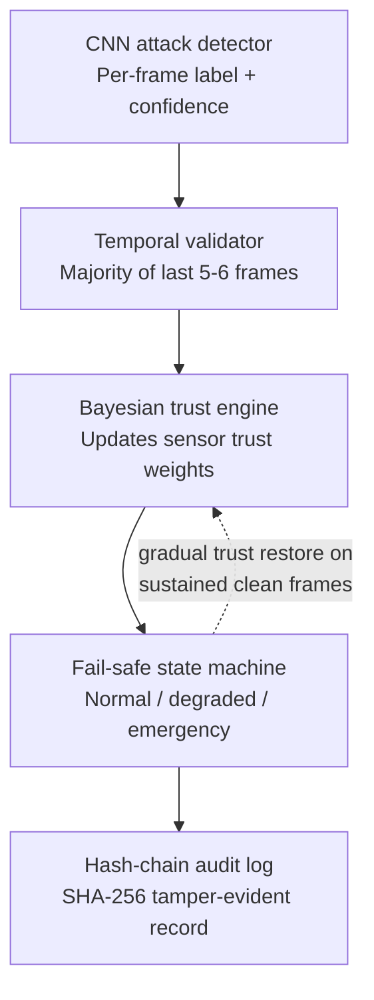

# Safety Mechanism (Objective 2) — Blueprint

**Project:** ResilientVision-Autonomous — Objective 2: Bayesian sensor-fusion safety fallback
**Owner:** (you)
**Last updated:** _update this line each time you touch this file_

---

## 1. What this part does (one paragraph)

When the CNN (Objective 1, built by teammates) flags a camera frame as possibly
attacked, this module decides whether to trust that flag, reallocates trust away
from the camera toward LiDAR/Radar/IMU, switches the vehicle into a degraded or
emergency-stop navigation mode if needed, and writes a tamper-evident log entry
for every confirmed attack event. It runs as a set of ROS 2 nodes, tested against
nuScenes Mini data, developed independently of the CNN using a stub publisher.

---

## 2. Pipeline overview (flowchart)

*(This renders automatically on GitHub/GitLab if you paste this file into your repo — teammates don't need any tool to view it.)*

---

## 3. Interface contract (agree with CNN teammate BEFORE building Step 2)

| Field | Type | Notes |
|---|---|---|
| `frame_id` | string | matches CNN's frame identifier |
| `label` | int (0/1) | 0 = clean, 1 = attacked |
| `confidence` | float [0,1] | softmax/sigmoid confidence |
| `timestamp` | float | for sync with sensor topics |

- ROS 2 topic name: `/detector/attack_status`
- Message type: _(decide: custom `.msg`, or plain `std_msgs`? — fill in once agreed)_

**Status:** ☐ Not yet agreed with teammate ☐ Agreed — write date here: ____________

---

## 4. Checklist — work through top to bottom

### Step 0 — Environment setup
- [ ] WSL2 + Ubuntu installed
- [ ] ROS 2 Jazzy Desktop installed (`ros-jazzy-desktop`, `ros-dev-tools`)
- [ ] `source /opt/ros/jazzy/setup.bash` added to `~/.bashrc`
- [ ] Verified: talker/listener demo works across two terminals
- [ ] `nuscenes-devkit` installed (`pip install nuscenes-devkit`)
- [ ] nuScenes Mini downloaded into `~/data/nuscenes` (inside Ubuntu, not Windows `C:`)
- [ ] Verified: `NuScenes(version='v1.0-mini', ...)` loads without error in Python

### Step 1 — Sensor data → ROS 2 topics
- [ ] nuScenes Mini scene converted to ROS 2 bag OR custom publisher script written
- [ ] Topics confirmed publishing: `/sensors/camera`, `/sensors/lidar`, `/sensors/radar`, `/sensors/imu`
- [ ] Verified with `ros2 topic echo /sensors/imu` during playback

### Step 2 — Stub CNN publisher
- [ ] Interface contract (Section 3 above) locked in with teammate
- [ ] Stub node built, publishing fake `{frame_id, label, confidence, timestamp}` on `/detector/attack_status`
- [ ] Test patterns scripted: long clean streak, single noisy frame, sustained attack (4+ of 6 frames)

### Step 3 — Bayesian trust engine (plain Python first, no ROS)
- [ ] Class written: input = current weights + (label, confidence) → output = updated weights
- [ ] Unit test: high-confidence attack → camera weight drops sharply
- [ ] Unit test: low/borderline confidence → weight barely moves
- [ ] Unit test: sustained clean frames → weight recovers gradually (not instantly)

### Step 4 — Temporal consistency validator (plain Python first, no ROS)
- [ ] Sliding window of last 5-6 frame labels implemented
- [ ] Majority (4+) required to confirm an attack
- [ ] Unit test: single noisy frame → ignored, no false trigger
- [ ] Unit test: 4-of-6 attacked → confirmed

### Step 5 — Fail-safe state machine
- [ ] States defined: `NORMAL` → `DEGRADED` → `EMERGENCY_STOP`
- [ ] `DEGRADED` trigger wired to Step 4's confirmed-attack output
- [ ] `EMERGENCY_STOP` trigger defined (what counts as "LiDAR/Radar insufficient" — write your definition here: ___________________)
- [ ] Gradual (not instant) restore to `NORMAL` on sustained clean frames
- [ ] Unit test each transition with a scripted input sequence

### Step 6 — Wrap into real ROS 2 nodes
- [ ] Steps 3-5 wrapped into a ROS 2 node subscribing to `/detector/attack_status` + `/sensors/*`
- [ ] Node publishes current trust weights + safety state on a new topic
- [ ] End-to-end test: Step 1 bag playback + Step 2 stub running together → visible state changes

### Step 7 — SHA-256 hash-chain audit logger (independent, do anytime)
- [ ] On confirmed attack: logs `{timestamp, position, frame_id, confidence, trust_weights, decision}`
- [ ] Each entry includes SHA-256 hash of the previous entry
- [ ] Test: tamper with an old log line, confirm the chain detectably breaks

---

## 5. Research references

- R. S. Hallyburton & M. Pajic, **"Bayesian Methods for Trust in Collaborative
  Multi-Agent Autonomy"** — arxiv.org/abs/2403.16956 (2024).
  Core reference for Step 3's trust-weighting design — hierarchical Bayesian
  updating, sensor measurements mapped to "trust pseudomeasurements."

- R. S. Hallyburton & M. Pajic, **"Security-Aware Sensor Fusion with MATE"** —
  arxiv.org/abs/2503.04954 (2025). More recent extension, good for
  state-of-the-art citation in the report.

- **AVstack** — open-source, ROS-integrated reference implementation of these
  trust-fusion ideas (Hallyburton & Pajic). Use as a pattern reference, not a
  drop-in dependency.

---

## 6. Notes / decisions log

_(Add a dated line every time you make a real decision or hit a blocker, so
future-you can reconstruct the "why" later — e.g. "2026-08-05: switched from
Humble to Jazzy because Store didn't offer 22.04 catalog entry, no functional
downside for our single-machine setup.")_

-
-
